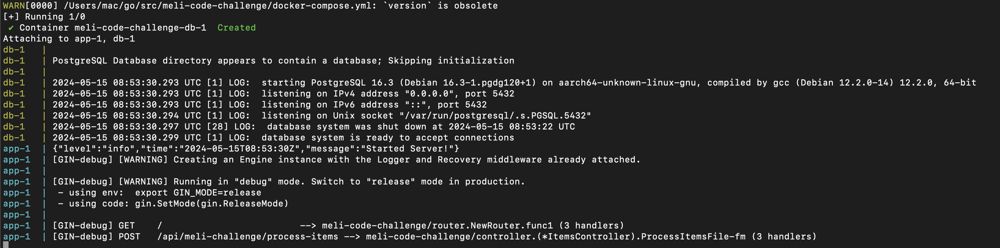
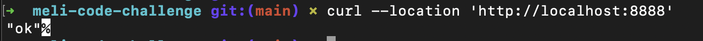
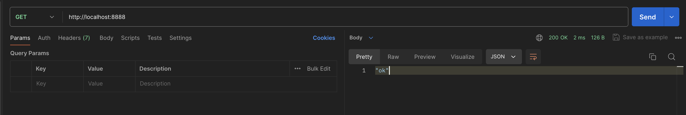
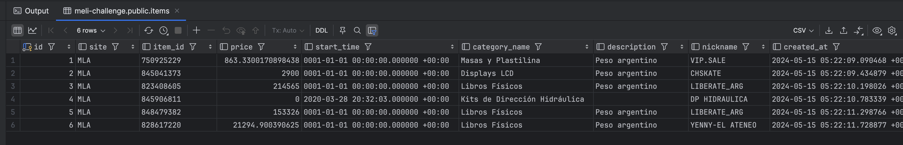
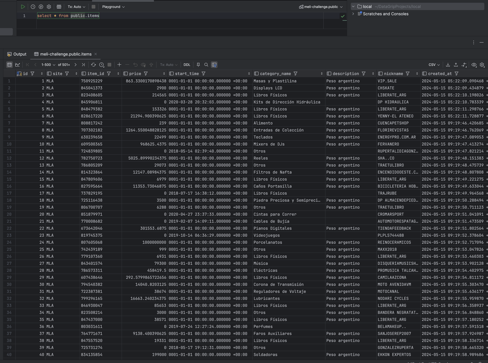

# Mercado Libre Code Challenge

## Overview

This project implements a basic API which uses the next technologies:

● Go

● Gin Framework

● Postgresql

● Docker

## Requirements

You need to have installed:

● Docker: make sure you have access from your terminal

● Postman or REST Client: It a best approach to have any REST client even though you can do the requests from the terminal.

● Database client.

● Terminal.

## Structure

Description and project structure:

The project has the next structure, in general terms it is focused in separate all the responsibilities in different files according to solid and clean principles.

```
.
├── Dockerfile
├── README.md
├── config
│   └── database.go
├── controller
│   └── items_controller.go
├── docker-compose.yml
├── go.mod
├── go.sum
├── helper
│   └── error.go
├── main.go
├── model
│   ├── items.go
│   └── meli.go
├── repository
│   ├── items_repository.go
│   └── items_repository_impl.go
├── resources
│   ├── meli_resource.go
│   └── meli_resource_impl.go
├── router
│   └── router.go
└── service
    ├── items_service.go
    └── items_service_impl.go

```

Functionality per file:

* **Dockerfile**: It contains the configuration for set up the image of the project.
* **README.md**: This file.
* **database.go**: It contains the basic configuration to connect to postgresql database.
* **items_controller.go**: It contains the methods to manage and give response to items API requests.
* **docker-compose.yml**: It contains a deep declaration about all resources, variables and parameters at the operating system level that this project needs to run and instantiate over docker platform.
* **go.mod** and **go.sum**: They contain the list of dependencies that this project needs.
* **model/**: This directory contains the models to create the schemas in the database as well as the golang structures to manage the data through the different "layers".
* **repository/**: This directory contains the files and methods to interact and make operations toward to the database.
* **resources/**: This directory contains the files and methods to interact and make request toward the Mercado Libre API.
* **router/**: This directory contains the files that describe the routes or group of routes to access this project from a REST Client.
* **service/**: This directory contains the files and methods which contains the gross logic as it can be but not limited to read files, perform interactions to the database, make algebraic operations, send events, process massive events, etc.
* **main.go**: It has the entry point file for the project.

## How to run this project

### 1. Execute and check communication

From a new terminal go to the root of this project and execute the next command.

```
$ docker compose up
```

During the execution process Docker going to download the images and build the containers described in the **docker-compose.yml**, please wait until the command has finished.



When it finished an output like the image must be appear. It indicates that the both containers are running and the container that has the project is waiting for requests.

Please in a new terminal make the next test request to make sure that the application is function correctly

```
curl --location 'http://localhost:8888'
```



Using postman:




### 2. Connect to the database from a client

Configure the next credentials in your database client:

**Engine**: Postgresql
**Host**: localhost
**Port**: 8889
**User**: postgres
**Password**: example
**Database**: meli-challenge

This configuration will permit you, to make queries to the database and see the schemas and stored information.

Once your are connected to the database successfully, you can execute the next query:

```
select * from public.items
```

**Exmple output:**




### 3. Use the exposed endpoint to load the file

Once the step one and step two are completed then you can test the endpoint documented in the challenge

Please execute the next curl in your terminal

```
curl --location 'http://localhost:8888/api/meli-challenge/process-items' \
--form 'file=@"./docs/technical_challenge_data.csv"'
```

The entire process can take up to 2 minutes until get completed.

After that you can see the output in the items table, example:



### 4. Some considerations

a) I did not include the functionallity which permits to read another type of streamable files.

b) I did not include the delimiter configuration, this project only works with CSV file delimited by commas.


## Answers theoric evaluation

## 1. Procesos, hilos y corrutinas

● Un caso en el que usarías procesos para resolver un problema y por qué.

Lo usuaria por ejemplo en un servidor web que necesita manejar múltiples solicitudes de clientes simultáneamente (multithread). Diseñaría el servidor web de manera que cada solicitud de cliente se maneje en su propio proceso separado. Esto proporcionaría un alto nivel de aislamiento entre las solicitudes de diferentes clientes. Si un proceso falla por alguna razón (por ejemplo, debido a un error en el código), los otros procesos no se verán afectados, ya que cada uno tiene su propio espacio de memoria y recursos asignados.

● Un caso en el que usarías threads para resolver un problema y por qué.

Supongamos que se tiene un servicio backend que necesita realizar operaciones intensivas en la CPU, como procesamiento de imágenes, análisis de datos complejos o cálculos matemáticos. Estas operaciones pueden consumir mucho tiempo de CPU y bloquear el hilo principal del servidor, lo que podría provocar una experiencia de usuario deficiente, ya que otras solicitudes quedarían en espera hasta que se complete la tarea intensiva.

En este caso, utilizaría threads para manejar estas operaciones intensivas en la CPU de manera asíncrona. Por ejemplo, podría tener un pool de hilos dedicados para manejar estas tareas. Cuando llega una solicitud que requiere una operación intensiva en la CPU, en lugar de bloquear el hilo principal del servidor, el servidor asigna uno de los hilos del pool para manejar esa tarea. Mientras tanto, el hilo principal del servidor sigue disponible para manejar otras solicitudes entrantes.

● Un caso en el que usarías corrutinas para resolver un problema y por qué.

Un caso en el que utilizaría corrutinas sería en un sistema de scraping web donde necesite recolectar datos de múltiples fuentes de manera eficiente y concurrente. Ejemplo:

En el desarrollo de un motor de búsqueda o un sistema de monitorización que necesita recolectar información de varias páginas web de forma regular y simultánea. Cada sitio web puede tener diferentes tiempos de respuesta y la recolección de datos puede ser una tarea intensiva en términos de tiempo.

En este caso, utilizaría corrutinas para manejar la recolección de datos desde cada sitio web de manera concurrente. Podría tener una corrutina dedicada para cada sitio web que estés rastreando. Cada corrutina sería responsable de realizar solicitudes HTTP, procesar el contenido de la página y extraer los datos relevantes.


## 2. Optimización de recursos del sistema operativo

Si tuvieras 1.000.000 de elementos y tuvieras que consultar para cada uno de ellos información en una API HTTP. ¿Cómo lo harías? Explicar.

Paso 1: Dividiría los elementos, de 1.000.000 de elementos en lotes más pequeños para poder manejarlos de manera más manejable y evitará una sobrecarga excesiva en la API HTTP. Por ejemplo, los dividiria en lotes de 100 o 1000 elementos cada uno.

Paso 2: Implementaría concurrencia: Utilizaría corrutinas para manejar las consultas HTTP de manera concurrente. Cada corrutina será responsable de realizar la consulta HTTP para un lote de elementos.

Paso 3: Control de concurrencia: Utilizaría un canal para controlar el número máximo de corrutinas concurrentes que se ejecutan a la vez para evitar sobrecargar la API HTTP con demasiadas solicitudes simultáneas, lo que podría resultar en respuestas más lentas o errores.

Paso 4: Manejo de errores: Implementaría mecanismos para manejar errores, como reintentos en caso de fallos temporales o manejo de errores permanentes.


## 3. Análisis de complejidad
● Dados 4 algoritmos A, B, C y D que cumplen la misma funcionalidad, con complejidades O(n2), O(n3), O(2n) y O(n log n), respectivamente, ¿Cuál de los algoritmos favorecerías y cuál descartarías en principio? Explicar por qué.


Para determinar qué algoritmo favorecer y cuál descartar en principio, es importante entender cómo se comportan las complejidades en función del tamaño de la entrada \( n \):

1. Algoritmo A: Complejidad \( O(n^2) \)
2. Algoritmo B: Complejidad \( O(n^3) \)
3. Algoritmo C: Complejidad \( O(2^n) \)
4. Algoritmo D: Complejidad \( O(n \log n) \)

Cada algoritmo:

- Algoritmo A (\( O(n^2) \)): Este algoritmo es cuadrático en el peor de los casos, lo que significa que el tiempo de ejecución aumentará rápidamente a medida que el tamaño de la entrada \( n \) crezca

- Algoritmo B (\( O(n^3) \)): Este algoritmo tiene una complejidad cúbica, lo que significa que su tiempo de ejecución aumenta aún más rápido que el algoritmo A a medida que \( n \) crece.

- Algoritmo C (\( O(2^n) \)): Este algoritmo tiene una complejidad exponencial, lo que significa que su tiempo de ejecución crece de manera exponencial con el tamaño de la entrada \( n \). Este tipo de algoritmo tiende a volverse impráctico muy rápidamente a medida que \( n \) aumenta, por lo que es poco probable que sea útil para tamaños grandes de entrada.

- Algoritmo D (\( O(n \log n) \)): Este algoritmo tiene una complejidad logarítmica, lo que significa que su tiempo de ejecución aumenta de manera mucho más lenta que los algoritmos anteriores a medida que \( n \) crece. Es eficiente para tamaños grandes de entrada y es ampliamente utilizado en problemas de optimización y ordenamiento.

En principio favorecería el Algoritmo D (\( O(n \log n) \)) ya que es más eficiente y escalable para tamaños grandes de entrada. Descartaría el Algoritmo C (\( O(2^n) \)) de inmediato debido a su naturaleza exponencial, que se vuelve rápidamente impráctica a medida que \( n \) crece. Los Algoritmos A y B (\( O(n^2) \) y \( O(n^3) \) respectivamente) pueden ser útiles para tamaños de entrada pequeños o medianos, pero no serían ideales para problemas con grandes conjuntos de datos debido a su crecimiento cuadrático y cúbico respectivamente.


● Asume que dispones de dos bases de datos para utilizar en diferentes problemas a resolver. La primera llamada AlfaDB tiene una complejidad de O(1) en consulta y O(n2) en escritura. La segunda llamada BetaDB que tiene una complejidad de O(log n) tanto para consulta, como para escritura. ¿Describe en forma sucinta, qué casos de uso podrías atacar con cada una?

Con base en las complejidades proporcionadas para las consultas y escrituras de las dos bases de datos (AlfaDB y BetaDB), podemos identificar diferentes casos de uso para cada una:

1. **AlfaDB**:
   - **Casos de uso adecuados**: AlfaDB sería adecuada para aplicaciones donde las consultas son frecuentes pero las escrituras son menos frecuentes y la eficiencia en las consultas es crítica. Por ejemplo:
     - Sistemas de análisis de datos en tiempo real donde se realizan muchas consultas para generar informes o visualizaciones.
     - Sistemas de monitoreo que necesitan acceder rápidamente a datos en tiempo real para tomar decisiones instantáneas.
   - **Ejemplo de caso de uso**: Un sistema de monitoreo de tráfico en tiempo real donde se necesitan realizar consultas frecuentes para analizar el flujo de tráfico, pero las actualizaciones en la base de datos (por ejemplo, para registrar eventos nuevos) son menos frecuentes.

2. **BetaDB**:
   - **Casos de uso adecuados**: BetaDB sería más adecuada cuando la eficiencia tanto en las consultas como en las escrituras es importante, especialmente en casos donde el tamaño de los datos puede ser grande. Por ejemplo:
     - Aplicaciones de comercio electrónico que manejan un gran volumen de transacciones y necesitan acceso rápido a datos de productos y pedidos.
     - Sistemas de gestión de inventario que necesitan realizar consultas y actualizaciones eficientes sobre grandes cantidades de datos de inventario.
   - **Ejemplo de caso de uso**: Un sistema de gestión de inventario para una cadena minorista que necesita realizar consultas frecuentes para verificar la disponibilidad de productos en diferentes ubicaciones, y también necesita actualizar el inventario cuando se realizan compras en línea o en la tienda.